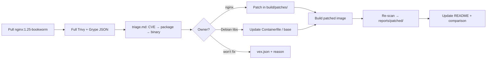

# CVE scanning and patching workflow

Guide for baseline vulnerability scans, triage, patching, and documentation for the `nginx-patched-build` pipeline.

**Baseline image:** `nginx:1.25-bookworm`  
**Scanners:** [Trivy](https://github.com/aquasecurity/trivy) and [Grype](https://github.com/anchore/grype) (run both; save full JSON for diffing)

---

## Overview



| Phase | Goal | Outputs |
|-------|------|---------|
| Baseline | Know what is vulnerable before changes | `reports/baseline/trivy.json`, `grype.json` |
| Triage | Map each CVE to package, path, and fix owner | `reports/baseline/triage.md` |
| Patch | Fix nginx CVEs or refresh OS packages | `build/patches/*.patch`, rebuilt image |
| Verify | Prove CVEs removed or documented | `reports/patched/*`, `vex.json` |

---

## Which scans to run for patching

Use **both** scanners on the **same image tag**. Do not rely on a single tool or on severity-filtered output for your saved baseline.

| Scan | Command purpose | Save? |
|------|-----------------|-------|
| **Full Trivy JSON** | Complete CVE list + `PkgName`, `PkgPath` | Yes — `trivy.json` |
| **Full Grype JSON** | Same, via `matches[].artifact` | Yes — `grype.json` |
| Trivy OS-only (optional) | Debian packages only | Optional — `trivy-os.json` |
| Summary (HIGH/CRITICAL) | Quick read for README tables | Optional — `*-summary.txt` |

**Do not** use `--severity HIGH,CRITICAL` only when writing the archived baseline. Filter when prioritizing; keep the full JSON for before/after diffs and VEX decisions.

**Scan the built image**, not an unbuilt `Containerfile`, when verifying a patch.

---

## Prerequisites

Run from **WSL/Linux** where Docker and scanners are installed.

```bash
docker version
docker pull nginx:1.25-bookworm

# Trivy (Debian/Ubuntu)
# https://aquasecurity.github.io/trivy/latest/getting-started/installation/

# Grype
curl -sSfL https://raw.githubusercontent.com/anchore/grype/main/install.sh | sudo sh -s -- -b /usr/local/bin

trivy image --download-db-only
grype db update
```

---

## Step 1: Pull baseline image

```bash
export IMAGE=nginx:1.25-bookworm

docker pull "$IMAGE"
docker inspect "$IMAGE" --format='{{index .RepoDigests 0}}'
```

Record the digest in `scan-metadata.txt` so later scans compare the same baseline.

---

## Step 2: Create report directories

From the repo root:

```bash
cd ~/echo-assignment/nginx-patched-build
# or: cd /mnt/c/Users/Mayan/echo-assignment/nginx-patched-build

export BASELINE_DIR=reports/baseline
export PATCHED_DIR=reports/patched
mkdir -p "$BASELINE_DIR" "$PATCHED_DIR"
```

Suggested layout:

```
nginx-patched-build/reports/
├── baseline/
│   ├── scan-metadata.txt
│   ├── trivy.json
│   ├── grype.json
│   ├── trivy-summary.txt      # optional
│   ├── grype-summary.txt      # optional
│   └── triage.md              # your analysis
└── patched/
    ├── scan-metadata.txt
    ├── trivy.json
    └── grype.json
```

---

## Step 3: Baseline scans (before patch)

```bash
export IMAGE=nginx:1.25-bookworm
export BASELINE_DIR=reports/baseline

# Full JSON (required)
trivy image -f json -o "$BASELINE_DIR/trivy.json" "$IMAGE"
grype "$IMAGE" -o json > "$BASELINE_DIR/grype.json"

# Optional: OS packages only
trivy image --scanners vuln --pkg-types os -f json -o "$BASELINE_DIR/trivy-os.json" "$IMAGE"

# Optional: human-readable summaries
trivy image --severity HIGH,CRITICAL "$IMAGE" | tee "$BASELINE_DIR/trivy-summary.txt"
grype "$IMAGE" -o table | tee "$BASELINE_DIR/grype-summary.txt"

# Metadata
{
  echo "image=$IMAGE"
  echo "scanned_at=$(date -u +%Y-%m-%dT%H:%M:%SZ)"
  docker inspect "$IMAGE" --format='digest={{index .RepoDigests 0}} id={{.Id}}'
  trivy --version
  grype version
} | tee "$BASELINE_DIR/scan-metadata.txt"
```

---

## Step 4: Triage CVEs (package → path → owner)

Create `reports/baseline/triage.md` using scanner output and container inspection.

### From Trivy JSON

```bash
jq -r '.Results[]?.Vulnerabilities[]? | "\(.VulnerabilityID)\t\(.Severity)\t\(.PkgName)\t\(.InstalledVersion)\t\(.PkgPath // "-")"' \
  reports/baseline/trivy.json | sort -u | column -t
```

### From Grype JSON

```bash
jq -r '.matches[] | "\(.vulnerability.id)\t\(.vulnerability.severity)\t\(.artifact.name)\t\(.artifact.version)\t\(.artifact.locations[]?.path // "-")"' \
  reports/baseline/grype.json | sort -u | column -t
```

### Field meanings

| Field | Meaning |
|-------|---------|
| `PkgName` / `artifact.name` | Debian package (e.g. `nginx`, `libssl3`, `libc6`) |
| `InstalledVersion` / `artifact.version` | Version in the image |
| `PkgPath` / `locations.path` | File on disk (e.g. `/usr/sbin/nginx`) |

### Map package to binary (inside image)

```bash
docker run --rm nginx:1.25-bookworm dpkg -S /usr/sbin/nginx
docker run --rm nginx:1.25-bookworm dpkg -L nginx
docker run --rm nginx:1.25-bookworm dpkg -l | grep -E 'nginx|ssl|libc|zlib'
docker run --rm nginx:1.25-bookworm ldd /usr/sbin/nginx
```

### Fix owner

| Owner | Typical packages | Action |
|-------|------------------|--------|
| **nginx** | `nginx`, paths under `/usr/sbin/nginx` | Add patch under `build/patches/`, rebuild via `build/build.sh` |
| **Debian / base** | `libssl3`, `libc6`, `zlib1g`, etc. | Update base image or `apt upgrade` in `Containerfile` |
| **Accepted / N/A** | Any | Document in `vex.json` with justification |

### Triage table template

Copy into `reports/baseline/triage.md`:

```markdown
# CVE triage — nginx:1.25-bookworm

| CVE | Severity | Package | Version | Path / binary | Owner | Action |
|-----|----------|---------|---------|---------------|-------|--------|
| CVE-YYYY-NNNN | HIGH | nginx | 1.25.x | /usr/sbin/nginx | nginx | Patch: `build/patches/CVE-YYYY-NNNN.patch` |
| CVE-YYYY-MMMM | HIGH | libssl3 | 3.0.x | .../libssl.so.3 | Debian | Rebuild base / apt in Containerfile |

## Scanner agreement
- Both Trivy and Grype report CVE-YYYY-NNNN on package `nginx`.
- Only Trivy reports CVE-... (investigate / document in VEX).

## Verification commands
- `dpkg -S /usr/sbin/nginx` → package `nginx`
```

### Compare CVE sets between scanners

```bash
jq -r '[.Results[]?.Vulnerabilities[]?.VulnerabilityID] | unique | .[]' reports/baseline/trivy.json | sort > /tmp/trivy-cves.txt
jq -r '[.matches[].vulnerability.id] | unique | .[]' reports/baseline/grype.json | sort > /tmp/grype-cves.txt
comm -23 /tmp/trivy-cves.txt /tmp/grype-cves.txt   # Trivy only
comm -13 /tmp/trivy-cves.txt /tmp/grype-cves.txt   # Grype only
```

---

## Step 5: Patch and build

1. Add the CVE patch under `build/patches/` (nginx-owned CVEs).
2. Run `build/build.sh` or the build Dockerfile.
3. Build the runtime image from `Containerfile`.
4. Tag the result, e.g. `nginx-patched:local`.

```bash
export PATCHED_IMAGE=nginx-patched:local
```

For OS-library CVEs, prefer base image or package updates in the image build rather than nginx source patches.

---

## Step 6: Patched image scans (after patch)

```bash
export PATCHED_IMAGE=nginx-patched:local
export PATCHED_DIR=reports/patched

trivy image -f json -o "$PATCHED_DIR/trivy.json" "$PATCHED_IMAGE"
grype "$PATCHED_IMAGE" -o json > "$PATCHED_DIR/grype.json"

{
  echo "image=$PATCHED_IMAGE"
  echo "scanned_at=$(date -u +%Y-%m-%dT%H:%M:%SZ)"
  docker inspect "$PATCHED_IMAGE" --format='digest={{index .RepoDigests 0}} id={{.Id}}'
} | tee "$PATCHED_DIR/scan-metadata.txt"
```

### Diff CVE IDs (baseline vs patched)

```bash
diff <(jq -r '[.Results[]?.Vulnerabilities[]?.VulnerabilityID] | unique | .[]' reports/baseline/trivy.json | sort) \
     <(jq -r '[.Results[]?.Vulnerabilities[]?.VulnerabilityID] | unique | .[]' reports/patched/trivy.json | sort)
```

Repeat with `grype.json` paths for Grype.

---

## Step 7: Document outcomes

### `vex.json` (project root)

Use for CVEs that **remain** after the patch but are:

- **Not affected** (not reachable, wrong component, false positive)
- **Deferred** (planned base image bump)
- **Risk accepted** (with explicit justification)

Link each entry to a row in `triage.md`.

### README.md (short narrative)

Add a **Security baseline and remediation** section:

```markdown
## Security baseline and remediation

- **Baseline:** `nginx:1.25-bookworm` (@sha256:…)
- **Scanners:** Trivy + Grype — see `docs/CVE-SCANNING-WORKFLOW.md` and `reports/`
- **Target CVE:** CVE-YYYY-NNNN — fixed by `build/patches/CVE-YYYY-NNNN.patch`
- **Verification:** CVE-YYYY-NNNN absent in `reports/patched/trivy.json` and `grype.json`
- **Residual:** see `vex.json`
```

### Before/after table (in README or triage)

| Scanner | Baseline HIGH+ | Patched HIGH+ | Notes |
|---------|----------------|---------------|-------|
| Trivy | N | M | CVE-… fixed |
| Grype | N | M | CVE-… fixed |

---

## What to skip

- Severity-only scans as the **only** saved baseline
- SARIF / CycloneDX unless CI or the rubric requires them
- Scanning `Containerfile` before the patched image is **built**

---

## Git

Large scan JSON files can stay local. To ignore them:

```gitignore
nginx-patched-build/reports/
```

Commit reports only if the assignment requires checked-in evidence.

---

## Quick reference

```bash
# One-shot baseline (from nginx-patched-build/)
export IMAGE=nginx:1.25-bookworm BASELINE_DIR=reports/baseline
mkdir -p "$BASELINE_DIR"
docker pull "$IMAGE"
trivy image -f json -o "$BASELINE_DIR/trivy.json" "$IMAGE"
grype "$IMAGE" -o json > "$BASELINE_DIR/grype.json"
```

See also: [README.md](../README.md), [vex.json](../vex.json).
